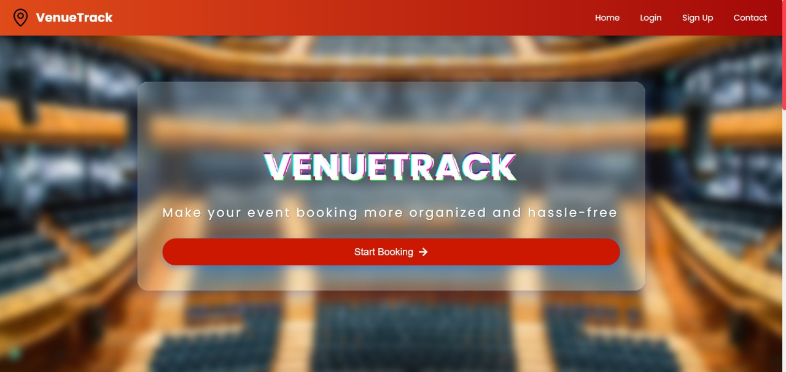
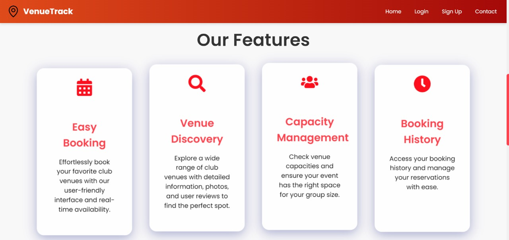

# 🎉 Venue Booking and Management System 🎉

  

## 🚀 Project Overview

A **full-stack platform** designed to simplify the process of booking and managing venues across a college campus. This system provides a seamless user experience, allowing users to sign up, log in, book venues, and provide feedback—all managed from a user-friendly admin dashboard. Built to optimize venue management with secure access and real-time tracking of bookings!

### 🎯 Features:
- 🎛️ **Admin Dashboard** to manage venues and bookings  
- 🔒 **Secure Login & Signup**  
- 📅 **Booking History** for past and upcoming bookings  
- 📝 **User Feedback System**  
- 📊 **Responsive Design** for smooth mobile and desktop experiences  

## 🛠️ Tech Stack

| Frontend | Backend | Database | Authentication |
| -------- | ------- | -------- | -------------- |
|  |  |  |  |

## 💻 Installation & Setup

### 1. Clone the repository:
```bash
git clone https://github.com/iRealDaksh/VenueTrack.git
```
### 2. Install the dependencies:
```bash
cd reponame
npm install
```
### 3. Start the development server:
```bash
npm start
```
### 4. Firebase setup:
Create a Firebase project here.
Enable Firestore and Authentication in Firebase.
Update your Firebase config in src/firebase-config.js.

###5. Environment Variables:
Create a .env file in the root directory and add your Firebase API keys:
```bash
REACT_APP_FIREBASE_API_KEY=your_api_key
REACT_APP_FIREBASE_AUTH_DOMAIN=your_auth_domain
REACT_APP_FIREBASE_PROJECT_ID=your_project_id
REACT_APP_FIREBASE_STORAGE_BUCKET=your_storage_bucket
REACT_APP_FIREBASE_MESSAGING_SENDER_ID=your_messaging_sender_id
REACT_APP_FIREBASE_APP_ID=your_app_id
```
###🎨 Screenshots



for the sample video of the home page visit the images folder

### 🏗️ Future Enhancements
🌟 Implement notifications for booking approvals
📲 Add mobile app version using React Native
📊 Advanced analytics for admins

### 📜 License
This project is licensed under the MIT License. See the LICENSE file for more details.

### 🙌 Contributors
Daksh Arora
Kishore Shashvat
Madhav Mittal
Ankur Kumar Singh


#### Feel free to contribute, submit issues, or reach out with any ideas! 🤝

### 📫 Contact:
For any queries, reach me at daksh7march2005@gmail.com or LinkedIn www.linkedin.com/in/daksharora-vitc27
